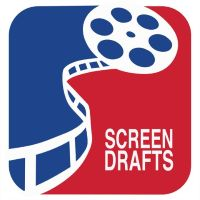
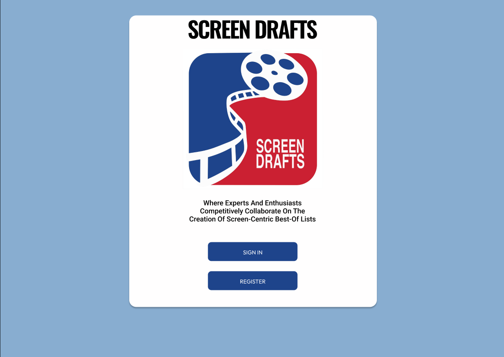
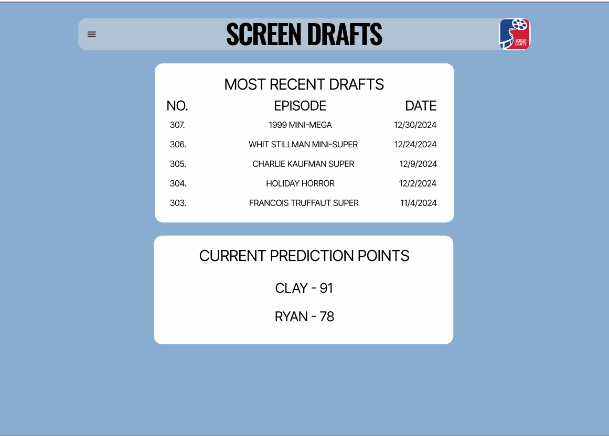

  

	
	
	

<h1 align="center">Screen Drafts</h1>

Screen Drafts is a podcast where experts and enthusiasts competitively collaborate in the creation of screen-centric "Best Of" lists.

This website application is being written to assist with the game format of the podcast. It will also act as a compendium to the <a href="https://screendrafts.fandom.com/wiki/Screen_Drafts">Screen Drafts Wiki</a>

It will be written in two parts: the front-end will use <a href="https://nextjs.org">Next.JS</a>, while the back-end API will use <a href="https://github.com/dotnet/core">.NET</a>.

<h2 align="center">Screenshots</h2>

	
	

## Author

- [@hmsiegel](https://www.github.com/hmsiegel)

