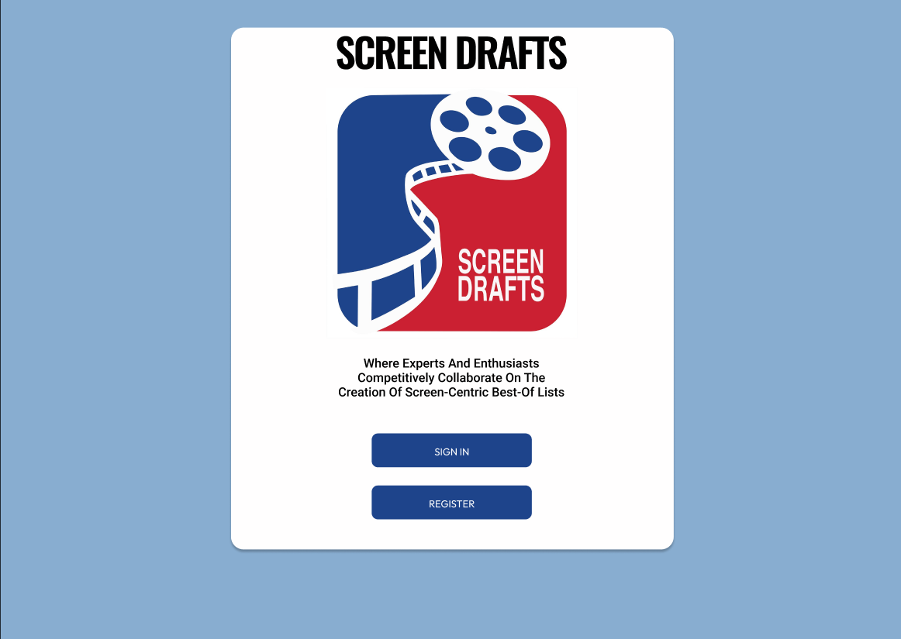
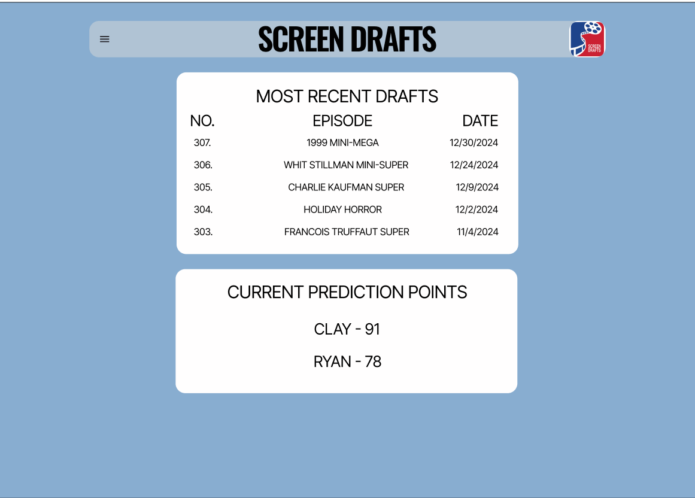

<p align="center">
  
</p>

<p align="center">
  
  
  
</p>

<h1 align="center">Screen Drafts</h1>

<p align="center">
  A full-stack web application for the <a href="https://screendrafts.fandom.com/wiki/Screen_Drafts">Screen Drafts podcast</a> — where guests competitively draft the best films of a given category. This app manages the drafting game mechanics, tracks picks and vetoes across episodes, and serves as a living compendium of every draft ever played.
</p>

---

## Overview

Screen Drafts the podcast runs a structured drafting game: a group of guests takes turns picking films for a "Best Of" list, with the ability to veto opponents' selections. Tracking this manually across dozens of episodes is error-prone and hard to query. This application solves that by:

- Providing a structured API for drafts, picks, vetoes, and drafters
- Exposing a read model for browsing historical drafts and their outcomes
- Integrating with IMDB/TMDB so film metadata is automatically populated
- Laying groundwork for a real-time drafting interface for live episodes

**Status:** Core API and data model are complete. The Next.js frontend currently reads from the database and displays drafts and picks. Real-time drafting UI (pick submission, vetoes, live session management) is in active development.

---

## Architecture

The application is composed of fifteen containerized services orchestrated with Docker Compose, spanning the full spectrum from application logic to observability infrastructure.

```
Browser
  │
  ▼
Next.js (UI)
  │  Auth via Keycloak (OIDC)
  ▼
YARP Gateway                ← single entry point for all API traffic
  │
  ├── /api/*  ──────────────► .NET API (ASP.NET Core / FastEndpoints)
  │                               │
  │                               ├── PostgreSQL     (primary data store)
  │                               ├── MongoDB        (user data)
  │                               ├── Redis          (response caching)
  │                               ├── RabbitMQ       (async event bus)
  │                               └── HashiCorp Vault (secrets)
  │
  └── /auth/* ─────────────► Keycloak (OAuth2 / OIDC identity server)
                                  └── keycloak-db (dedicated PostgreSQL)

Observability
  ├── Jaeger              (distributed tracing / OpenTelemetry)
  ├── Seq                 (structured log querying)
  ├── ELK Stack           (log aggregation — Elasticsearch, Logstash, Kibana)
  └── Papercut SMTP       (local email testing)

Infrastructure
  └── DB Migrator         (one-shot migration runner, exits before API starts)
```

### Service startup ordering

The API does not start until the following conditions are all satisfied — enforced via Docker Compose `depends_on` conditions:

- Database migrator has **completed successfully** (`service_completed_successfully`)
- Vault init has **completed successfully**, meaning all secrets are seeded
- PostgreSQL, Keycloak, Redis, RabbitMQ, Seq, Jaeger, MongoDB, and ELK have **started**

Vault itself is health-checked before the init container runs, using a `wget` probe against the `/v1/sys/health` endpoint.

### Why these technology choices?

**YARP (reverse proxy):** All traffic flows through a single gateway rather than the frontend talking directly to the API and identity server on different ports. This mirrors how production deployments work — one origin, with the proxy handling routing, future rate limiting, and header rewriting.

**Keycloak with custom extensions:** Rather than rolling auth from scratch, Keycloak handles OAuth2/OIDC token issuance and user management. The project goes further than a standard Keycloak integration: a custom theme (built with Keycloakify) and a custom authenticator JAR are both mounted into the container, meaning the login experience is purpose-built for this application.

**HashiCorp Vault:** Secrets are not stored in environment variables or config files. Vault runs in dev mode (auto-unsealed, in-memory) during development; a `vault-init` container seeds all secrets on startup and exits, and the API depends on that init completing successfully before it boots. This is the same pattern used in production Vault deployments, just without persistence.

**RabbitMQ + MassTransit:** Domain events (pick made, veto cast) are published to RabbitMQ via MassTransit rather than handled synchronously. This decouples cache invalidation and any future notification logic from the request path. MassTransit's mediator pattern means handlers don't know about the message broker — swapping transports requires no application code changes.

**Polyglot persistence (PostgreSQL + MongoDB):** The primary relational data (drafts, picks, films) lives in PostgreSQL, managed through Entity Framework Core with code-first migrations. MongoDB handles user-specific data that maps poorly to a relational schema. A dedicated PostgreSQL instance backs Keycloak, keeping identity data isolated from application data.

**Observability stack:** Three complementary tools cover different observability needs. Jaeger captures distributed traces via OpenTelemetry, so request latency can be profiled across service boundaries. Seq provides structured log querying during development. ELK handles log aggregation for volume search. Papercut catches outbound email locally without an external SMTP dependency.

**MediatR + FastEndpoints + CQRS:** Commands and queries are dispatched through MediatR, keeping endpoint handlers thin. FastEndpoints is used over MVC controllers for its performance characteristics and minimal ceremony. The CQRS split means read models can evolve independently of write models as query patterns change.

---

## Project Structure

```
screendrafts
├───build
├───docs
│   └───img
├───res
├───samples
├───scripts
├───src
│   ├───keycloak
│   │   └───screendrafts-authenticator                                # Java Keycloak social integration
│   ├───screendrafts-keycloak-theme                                   # Keycloakify Theme for ScreenDrafts
│   ├───src/screendrafts.api
│   │   ├───build
│   │   ├───data
│   │   ├───dep
│   │   ├───doc
│   │   ├───infrastructure
│   │   │   └───vault                                                 # Seeds all secrets into Vault on startup
│   │   ├───res
│   │   ├───src
│   │   │   ├───api
│   │   │   │   ├───ScreenDrafts.Gateway                              # Startup, config
│   │   │   │   └───ScreenDrafts.Web                                  # YARP reverse proxy service
│   │   │   ├───common
│   │   │   │   ├───ScreenDrafts.Common.Abstractions                  # Result objects, Error objects, Global exceptions
│   │   │   │   ├───ScreenDrafts.Common.Application                   # CQRS command/ queries, messaging, event bus, interfaces
│   │   │   │   ├───ScreenDrafts.Common.ArchitectureTests             # Common architecture test classes
│   │   │   │   ├───ScreenDrafts.Common.Domain                        # Entities, value objects, domain events
│   │   │   │   ├───ScreenDrafts.Common.Infrastructure                # Application interface implementations, database, EF Core
│   │   │   │   ├───ScreenDrafts.Common.IntegrationTests              # Common integration test classes
│   │   │   │   ├───ScreenDrafts.Common.Presentation                  # FastEndpoint results and responses
│   │   │   │   └───ScreenDrafts.Common.UnitTests                     # Common unit test classes
│   │   │   └───modules
│   │   │       ├───administration                                    # Roles and permissions
│   │   │       ├───audit                                             # Audit logging
│   │   │       ├───communications                                    # Email services
│   │   │       ├───drafts                                            # Main application module
│   │   │       ├───integrations                                      # External integrations (Zoom, IMDb, OMDb, TMDb, IGDb)
│   │   │       ├───movies                                            # Main movie module
│   │   │       ├───real-time-updates                                 # SignalR
│   │   │       ├───reporting                                         # Drafter and movie honorifics
│   │   │       └───users                                             # User administration
│   │   ├───test
│   │   │   ├───ScreenDrafts.ArchitectureTests                        # System-wide architecture tests
│   │   │   └───ScreenDrafts.IntegrationTests                         # System-wide integration tests
│   │   └───tools
│   │       ├───ScreenDrafts.Seeding.Drafts                           # Seeding Drafts
│   │       ├───ScreenDrafts.Seeding.Honorifics                       # Seeding honorifics
│   │       ├───ScreenDrafts.Seeding.Movies                           # Seeding movies
│   │       ├───ScreenDrafts.Seeding.Users                            # Seeding users
│   │       ├───ScreenDrafts.Tools.DbMigrator                         # One shot EF Core migration runner
│   │       └───ScreenDrafts.Tools.EfModelDump                        # One shot DB Schema dump
│   └───screendrafts.ui                                               # Next.js Front-end (TypeScript + Tailwind)
├───test
└───tools
    ├───draft-scraper
    ├───drafter-scraper
    └───rename-drafters
```

---

## Tech Stack

### Backend
| Technology | Purpose |
|---|---|
| ASP.NET Core / C# | Web API framework |
| FastEndpoints | Lightweight endpoint definition |
| Entity Framework Core | ORM / database migrations |
| MediatR | CQRS mediator (commands, queries, domain events) |
| MassTransit + RabbitMQ | Async messaging / event-driven architecture |
| YARP | Reverse proxy / API gateway |
| Keycloak | OAuth2 / OIDC identity server (custom theme + authenticator) |
| HashiCorp Vault | Secrets management |
| Redis | Response caching |
| PostgreSQL | Primary relational database |
| MongoDB | User data store |
| Serilog | Structured logging (outputs to Seq + ELK) |
| FluentValidation | Request validation |
| Ardalis.GuardClauses | Domain invariant enforcement |
| Ardalis.SmartEnum | Type-safe enumerations |
| Bogus | Seed data generation |

### Observability
| Technology | Purpose |
|---|---|
| Jaeger | Distributed tracing (OpenTelemetry) |
| Seq | Structured log querying |
| ELK Stack | Log aggregation (Elasticsearch, Logstash, Kibana) |
| Papercut SMTP | Local email testing |

### Frontend
| Technology | Purpose |
|---|---|
| Next.js (TypeScript) | Full-stack React framework |
| Tailwind CSS | Utility-first styling |
| Keycloakify | Custom Keycloak login theme |

---

## Getting Started

### Prerequisites

- Docker Desktop (or Docker Engine + Compose)
- Node.js 18+ (for the frontend)

### 1. Clone the repository

```bash
git clone https://github.com/hmsiegel/ScreenDrafts.git
cd ScreenDrafts
```

### 2. Configure development secrets

Development config files (`*.Development.json`) are excluded from source control. Copy the provided templates and fill in your credentials.

**IMDB integration:**
```bash
cp src/screendrafts.api/src/api/ScreenDrafts.Web/modules.integrations.Development.template.json \
   src/screendrafts.api/src/api/ScreenDrafts.Web/modules.integrations.Development.json
```
Then replace `{{IMDB_API_KEY}}` with your key from [tv-api.com](https://tv-api.com).

Repeat for any other `*.Development.template.json` files found in the project.

### 3. Start the backend

```bash
docker compose up
```

This starts all backend services: PostgreSQL, MongoDB, Redis, RabbitMQ, Keycloak, YARP gateway, the .NET API, Vault, and the full observability stack. Initial startup takes a minute or two — Keycloak and ELK are the slowest to initialize.

Once running, the following ports are available:

| Service | URL |
|---|---|
| API (via YARP gateway) | http://localhost:3000 |
| Keycloak admin | http://localhost:18080 |
| RabbitMQ management | http://localhost:15672 |
| Seq logs | http://localhost:8081 |
| Jaeger traces | http://localhost:16686 |
| Kibana | http://localhost:5601 |
| Vault | http://localhost:8200 |

### 4. Start the frontend

```bash
cd src/screendrafts.ui
npm install
npm run dev
```

The UI will be available at `http://localhost:3000` (proxied through YARP).

> **Note:** Full Docker Compose support for the frontend is planned.

---

## Screenshots

<p align="center">
  
  
</p>

---

## Roadmap

- [x] Domain model: Drafts, Picks, Vetoes, Drafters, Films
- [x] REST API with CQRS / MediatR
- [x] IMDB / OMDB integration for film metadata
- [x] Auth via Keycloak (OIDC) with custom theme and authenticator
- [x] Redis caching with event-driven invalidation
- [x] RabbitMQ async event bus via MassTransit
- [x] HashiCorp Vault for secrets management
- [x] Distributed tracing with Jaeger / OpenTelemetry
- [x] Structured logging with Serilog → Seq + ELK
- [x] Frontend: browse drafts and picks
- [ ] Real-time drafting session UI
- [ ] Pick submission and veto UI
- [ ] Live session management (active draft state)
- [x] User profiles and drafter statistics
- [ ] Health checks on all backing services
- [ ] Frontend Docker Compose integration

---

## Author

[@hmsiegel](https://github.com/hmsiegel)

[](https://opensource.org/licenses/)